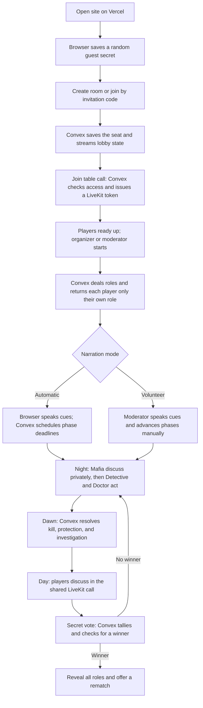

# Mafia Online: system design and user journey

This describes the current implementation. The [product plan](PLAN.md) covers detailed game rules and release scope.

## Services

| Service | Responsibility |
| --- | --- |
| Vercel / Next.js | Serves the website and runs the browser interface. |
| Convex | Stores rooms, players, choices, and events; enforces game rules and permissions; streams each player's allowed state; schedules automatic phase changes; issues LiveKit access tokens. |
| LiveKit Cloud | Carries the actual camera and microphone streams. It has a shared table room, phase-specific private Mafia rooms, and an audio-only moderator channel when a player volunteers to moderate. |

The browser talks to Convex for game actions and state, and to LiveKit for media. The LiveKit API secret stays in Convex; the browser receives only a short-lived token for the room it may join.

## Journey from opening the site to rematch

### 1. Create or join

The browser generates a guest secret and stores it with the seat in local storage. The room code is an invitation, not an identity credential. Convex stores a hash of the guest secret and uses it to recognize the same player on reconnect. It keeps the room and player records in its database.

### 2. Gather in the lobby

The browser subscribes to `games.state`; Convex updates the roster, readiness, and settings as they change. Each browser sends a heartbeat while at the table. Joining the call invokes a Convex action that checks the current seat and phase, then creates a LiveKit token. Microphone and camera start off. At least six people must be playing; a volunteer moderator is an additional, non-playing person.

### 3. Start and reveal roles

The organizer or volunteer moderator starts only when everyone is ready and has sent a recent heartbeat. Convex shuffles the role deck and stores the assignments. Its personalized state query returns a player's own role, Mafia teammates when applicable, and public information. It does not send other players' hidden roles or votes before the game ends.

### 4. Play the round

The order is **Mafia → Detective → Doctor → dawn → day discussion → secret vote**. Only living Mafia receive a token for their private video room. Detective and Doctor submit private actions through Convex; they do not get a player video room for those turns. At dawn, Convex resolves all night choices together, announces any death, and privately returns the investigation result to the Detective. Daytime discussion uses the shared LiveKit room. Convex tallies votes, checks victory, and either starts another night or ends the game.

Automatic mode uses Convex deadlines and scheduled functions to advance phases; the browser speaks the cues after joining the call. Volunteer mode has no phase timers: the non-playing moderator speaks the cues and presses the advance button. Their separate audio-only channel reaches players during reveal, night, and voting without giving them access to the Mafia conversation.

### 5. Change media rooms safely

Each phase change enters a temporary `transition` state. Convex stops issuing tokens for the old phase, closes the previous LiveKit room, then opens the next phase with a fresh media-room name. Browsers discard stale tokens and request new ones when allowed. If media cleanup fails, the game stays in the transition state and retries instead of opening a potentially leaking call.

### 6. Reconnect, finish, and rematch

Refreshing the page preserves the player's seat through the locally saved guest secret. Convex resends that player's current game view; the browser requests a new LiveKit token for the active phase. A disconnected player keeps their role. At the end, all roles become public. The organizer or moderator can reset roles and readiness for another game in the same room.

## Code map

- [`components/mafia-app.tsx`](../components/mafia-app.tsx): browser session, lobby, game screens, and Convex subscriptions.
- [`components/media-stage.tsx`](../components/media-stage.tsx) and [`components/moderator-channel.tsx`](../components/moderator-channel.tsx): LiveKit calls and controls.
- [`convex/games.ts`](../convex/games.ts): authoritative game actions, per-player state, phase transitions, and scheduling.
- [`convex/media.ts`](../convex/media.ts): LiveKit token grants and old-room cleanup.
- [`convex/lib/rules.ts`](../convex/lib/rules.ts): role decks, action resolution, voting, and victory rules.
- [`convex/schema.ts`](../convex/schema.ts): `games`, `players`, `choices`, `investigations`, and `events` tables.
