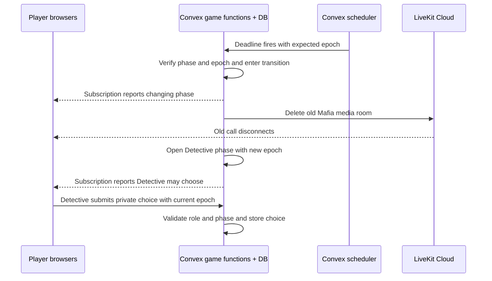
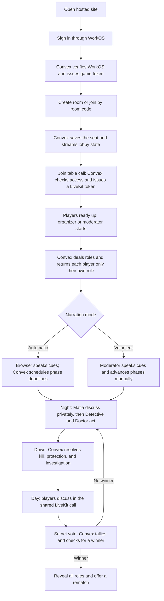

# Mafia Online: system design and user journey

This describes the current implementation. The [product plan](PLAN.md) covers detailed game rules and release scope.

## Services

| Service | Responsibility |
| --- | --- |
| WorkOS AuthKit | Signs in invited people and manages their account sessions. Public sign-up is disabled on the hosted site. |
| Vercel / Next.js | Serves the website and browser interface, starts the WorkOS sign-in flow, and handles its callback. |
| Convex | Verifies the WorkOS token, issues a short-lived game token, stores rooms and game data, enforces player permissions, streams each player's allowed state, schedules phases, and issues LiveKit access tokens. |
| LiveKit Cloud | Carries the actual camera and microphone streams. It has a shared table room, phase-specific private Mafia rooms, and an audio-only moderator channel when a player volunteers to moderate. |

The hosted site requires a WorkOS account invited by the organizer. A separate six-character room code identifies a game. The browser talks to Convex for game actions and state, and to LiveKit for media. Local development can instead use the older guest-invitation mode. The LiveKit API secret stays in Convex; the browser receives only a short-lived token for the call room it may join.

## What each resource actually does

| Resource | Technical concept | What that means in this game |
| --- | --- | --- |
| Player's browser | **Client application and device APIs** | React draws the screens. Local storage remembers the player's seat. Browser speech synthesis reads automatic cues. Camera and microphone access happens on the player's device. |
| Vercel + Next.js | **Web hosting and authentication callback** | Vercel builds and serves the site. Next.js redirects to WorkOS, handles the return callback, and loads the account session. The browser JavaScript knows the public Convex URL. |
| WorkOS AuthKit | **Identity provider** | Hosted sign-in checks the invited account and returns an access token representing that user. It does not assign Mafia roles or control game rooms. |
| Convex database | **Persistent documents and indexes** | `invitations`, `games`, `players`, `choices`, `investigations`, and `events` survive refreshes. Indexes look up invitations by hash or claimed session, rooms by code, players by game or session, and choices by game and phase epoch. |
| Convex functions | **Server-side application logic and authorization** | A token-exchange action verifies WorkOS and signs a game token. Queries read permitted state; mutations validate and atomically change game records; other actions call LiveKit using server-held secrets. |
| Convex subscriptions | **Realtime state sync** | Each browser subscribes to `games.state`. When a relevant database record changes, Convex sends that player's updated view over its client connection, so the roster, phase, and result update without polling the full game. |
| Convex scheduler | **Durable background jobs** | Automatic narration mode schedules the next phase at a deadline. Transitions schedule LiveKit room cleanup and retry it on failure. |
| LiveKit Cloud | **WebRTC media and an SFU** | Players publish camera/microphone *tracks* to a LiveKit room. Its selective forwarding unit relays those tracks to permitted participants, giving the group a low-latency call. |
| LiveKit tokens | **Room-scoped authorization** | Convex signs a token with a room name, player identity, and publish/subscribe permissions. The browser presents it when connecting to LiveKit. |

The key separation is **game data versus live media**. A vote, role, timer, and death are Convex records; voice and video are LiveKit tracks. Vercel delivers the app but does not make phase decisions. See [Convex React subscriptions](https://docs.convex.dev/client/react/overview), [scheduled functions](https://docs.convex.dev/scheduling/scheduled-functions), and [LiveKit's SFU](https://docs.livekit.io/reference/internals/livekit-sfu/).

### Who handles login and access?

**Authentication** answers “who signed in?” WorkOS AuthKit owns that part. The hosted site disables public sign-up and the organizer invites people through WorkOS. Next.js starts the redirect to WorkOS and handles the callback. **Authorization** answers “what may this signed-in person do?” Convex owns that part: its functions check the verified account, the player's seat, current role, and game phase before allowing actions. LiveKit only accepts a separate, room-scoped media token issued after Convex checks access.

The hosted sign-in follows these steps:

1. The player opens the Vercel site and clicks Sign in. [`app/sign-in/route.ts`](../app/sign-in/route.ts) redirects to WorkOS; WorkOS checks the invited account using the enabled sign-in method, such as an email code.
2. WorkOS redirects back to [`app/callback/route.ts`](../app/callback/route.ts). The AuthKit SDK completes the callback and establishes the site's account session. [`proxy.ts`](../proxy.ts) and [`app/page.tsx`](../app/page.tsx) make that session available when the page loads.
3. The browser obtains a WorkOS access token through AuthKit. WorkOS signed that token, but its current header omits `typ`, which Convex requires for a custom JWT. The browser cannot edit a signed token without invalidating its signature.
4. [`convex/authBridge.ts`](../convex/authBridge.ts) uses WorkOS's public key to verify the token's signature, issuer, and expiry. [`convex/lib/bridge.ts`](../convex/lib/bridge.ts) also checks that the token belongs to this WorkOS application, then signs a five-minute Convex-compatible token for the same user. The private signing key is stored only in the Convex deployment.
5. The browser sends that game token to Convex. [`convex/auth.config.ts`](../convex/auth.config.ts) gives Convex the corresponding public key and expected issuer and audience. [`convex/lib/auth.ts`](../convex/lib/auth.ts) checks the application ID and uses the WorkOS user ID to bind the player's seat across devices.
6. The player creates or joins a room with its six-character code. A later call to LiveKit uses a different token: Convex checks the seat and game phase, then issues a token allowing only the appropriate audio/video room.

This is a **token exchange** between identity systems: WorkOS proves the person's identity; Convex verifies that proof and issues the format its game backend accepts. The WorkOS token and Convex game token are both distinct from the LiveKit media token. In local guest mode, WorkOS is off: the browser redeems a site invitation and uses a random guest secret whose hash is stored by Convex. The hosted account mode still creates a browser secret for the shared UI, but Convex uses the verified WorkOS user ID, not that secret, as the player's identity.

The browser calls Convex mutations for actions such as readying up, submitting a choice, and starting the game. It subscribes to a personalized query for display. A heartbeat updates a separate presence record once per minute; the browser checks presence with a one-off query rather than another subscription. Heartbeats and checks pause in hidden tabs without a live call and stop when the game ends. This keeps frequent presence writes from rerunning every player's personalized game-state query. The backend checks presence before starting or allowing takeover; actual call connectivity is tracked by the LiveKit component. Automatic spoken cues use the browser's speech synthesis after the call has connected. In volunteer mode, a non-playing moderator speaks and advances phases instead.

### Convex: storage, rules, and timing

Think of a **query** as “show me my current view,” a **mutation** as “check and change game state,” and an **action** as “talk to another service.” `games.state` returns public room facts plus only the caller's private role, choices, and Detective result. `games.choose` checks the role, phase, target, and epoch before writing a choice. `media.token` is a Node action that reads an internal permission decision and signs a LiveKit token. The application code in [`convex/games.ts`](../convex/games.ts) and [`convex/media.ts`](../convex/media.ts) defines these behaviors; Convex supplies the database, function runtime, subscriptions, and scheduler.

The phase is a **state machine**: lobby → reveal → Mafia → Detective → Doctor → day → vote → another night or ended. A transition temporarily sets `phase = transition`, closes the old media room, then opens the next phase. The numeric **epoch** increments at each transition. A choice or media-token request carrying an old epoch is rejected, which keeps delayed clicks and stale jobs from affecting the new scene. Automatic mode uses scheduled deadlines; volunteer mode waits for the moderator's advance action. See [Convex function runtimes](https://docs.convex.dev/functions/runtimes) and [scheduled functions](https://docs.convex.dev/scheduling/scheduled-functions).

### LiveKit: call rooms and permissions

A LiveKit **room** is the call space, a **participant** is one connected person, and a **track** is one microphone or camera stream. The app uses a shared table room for lobby/day, a private room for the Mafia turn, and a separate moderator audio room in volunteer mode. Detective and Doctor submit private choices in Convex rather than joining their own video room. LiveKit carries media, while Convex decides who receives a token for each room. See [rooms, participants, and tracks](https://docs.livekit.io/intro/basics/rooms-participants-tracks/) and [access tokens and grants](https://docs.livekit.io/frontends/reference/tokens-grants/).

The token's **grant** allows joining one named room, subscribing to tracks, and publishing only permitted camera/microphone sources. The moderator channel permits microphone publishing only for the moderator; players can listen. The token has a 30-second lifetime for the initial connection, so the browser requests a fresh one when joining a new phase. Expiry is not the mechanism that removes an already connected player: the transition closes the old LiveKit room before opening the next one.

### Deployment and secrets

The Vercel build command in [`vercel.json`](../vercel.json) runs `npx convex deploy`, then the Next.js build. `CONVEX_DEPLOY_KEY` tells that command **which Convex deployment** to update. The command supplies that deployment's public `NEXT_PUBLIC_CONVEX_URL` to the frontend build; browsers use the URL to reach it. Vercel also holds the WorkOS API key and session-cookie secret for Next.js. The selected Convex deployment holds the game-token signing private key and the LiveKit API secret. The Convex deploy key, WorkOS API key, signing private key, and LiveKit API secret are never browser variables. See [Convex's Vercel deployment guide](https://docs.convex.dev/production/hosting/vercel) and the [setup instructions](../README.md#invited-email-accounts).

## One request across the resources

For example, when the Mafia turn ends in automatic mode:

This illustrates two separate realtime paths: **Convex subscriptions** update the game interface, while **LiveKit/WebRTC** handles the call. A phase change affects both, but only Convex determines the next phase and access rights.

## Journey from opening the site to rematch

### 1. Create or join

On the hosted site, the player signs in with their invited WorkOS account before creating or joining a room. The room code identifies a specific game; it is not a login credential. Convex associates the seat with the verified WorkOS user ID and keeps the room and player records in its database. Local guest mode instead redeems a site invitation and associates the seat with a hashed browser secret.

### 2. Gather in the lobby

The browser subscribes to `games.state`; Convex updates the roster, readiness, and settings as they change. An active browser sends a heartbeat and reads a presence snapshot once per minute. Presence lives in a separate table so its frequent writes do not invalidate the game-state subscription. Joining the call invokes a Convex action that checks the current seat and phase, then creates a LiveKit token. Microphone and camera start off. At least six people must be playing; a volunteer moderator is an additional, non-playing person.

### 3. Start and reveal roles

The organizer or volunteer moderator starts only when everyone is ready and has sent a recent heartbeat. Convex shuffles the role deck and stores the assignments. Its personalized state query returns a player's own role, Mafia teammates when applicable, and public information. It does not send other players' hidden roles or votes before the game ends.

### 4. Play the round

The order is **Mafia → Detective → Doctor → dawn → day discussion → secret vote**. Only living Mafia receive a token for their private video room. Detective and Doctor submit private actions through Convex; they do not get a player video room for those turns. At dawn, Convex resolves all night choices together, announces any death, and privately returns the investigation result to the Detective. Daytime discussion uses the shared LiveKit room. Convex tallies votes, checks victory, and either starts another night or ends the game.

Automatic mode uses Convex deadlines and scheduled functions to advance phases; the browser speaks the cues after joining the call. Volunteer mode has no phase timers: the non-playing moderator speaks the cues and presses the advance button. Their separate audio-only channel reaches players during reveal, night, and voting without giving them access to the Mafia conversation.

### 5. Change media rooms safely

Each phase change enters a temporary `transition` state. Convex stops issuing tokens for the old phase, closes the previous LiveKit room, then opens the next phase with a fresh media-room name. Browsers discard stale tokens and request new ones when allowed. If media cleanup fails, the game stays in the transition state and retries instead of opening a potentially leaking call.

### 6. Reconnect, finish, and rematch

Refreshing the page preserves the seat in browser storage; on the hosted site, Convex also checks that the signed-in WorkOS account still owns it. In local guest mode, it checks the guest secret. Convex resends that player's current game view; the browser requests a new LiveKit token for the active phase. A disconnected player keeps their role. At the end, all roles become public. The organizer or moderator can reset roles and readiness for another game in the same room.

## Code map

- [`components/mafia-app.tsx`](../components/mafia-app.tsx): browser session, lobby, game screens, and Convex subscriptions.
- [`app/sign-in/route.ts`](../app/sign-in/route.ts), [`app/callback/route.ts`](../app/callback/route.ts), and [`proxy.ts`](../proxy.ts): WorkOS redirect, callback, and web-session handling.
- [`convex/authBridge.ts`](../convex/authBridge.ts), [`convex/lib/bridge.ts`](../convex/lib/bridge.ts), and [`convex/auth.config.ts`](../convex/auth.config.ts): verify the WorkOS token, issue a short-lived game token, and configure Convex to accept it.
- [`convex/lib/auth.ts`](../convex/lib/auth.ts): identify the signed-in account or the local guest and enforce seat access.
- [`components/media-stage.tsx`](../components/media-stage.tsx) and [`components/moderator-channel.tsx`](../components/moderator-channel.tsx): LiveKit calls and controls.
- [`convex/games.ts`](../convex/games.ts): authoritative game actions, per-player state, phase transitions, and scheduling.
- [`convex/invitations.ts`](../convex/invitations.ts): one-time invite redemption, admission status, admin issue, and revocation.
- [`convex/media.ts`](../convex/media.ts): LiveKit token grants and old-room cleanup.
- [`convex/lib/rules.ts`](../convex/lib/rules.ts): role decks, action resolution, voting, and victory rules.
- [`convex/schema.ts`](../convex/schema.ts): `games`, `players`, `choices`, `investigations`, and `events` tables.
