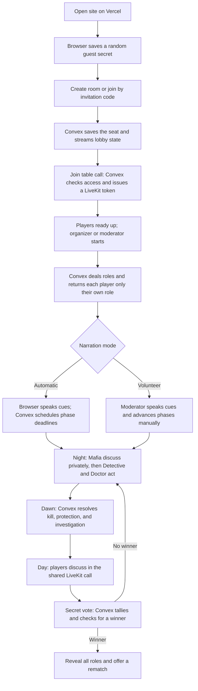

# Mafia Online: system design and user journey

This describes the current implementation. The [product plan](PLAN.md) covers detailed game rules and release scope.

## Services

| Service | Responsibility |
| --- | --- |
| Vercel / Next.js | Serves the website and runs the browser interface. |
| Convex | Stores rooms, players, choices, and events; enforces game rules and permissions; streams each player's allowed state; schedules automatic phase changes; issues LiveKit access tokens. |
| LiveKit Cloud | Carries the actual camera and microphone streams. It has a shared table room, phase-specific private Mafia rooms, and an audio-only moderator channel when a player volunteers to moderate. |

The browser talks to Convex for game actions and state, and to LiveKit for media. The LiveKit API secret stays in Convex; the browser receives only a short-lived token for the room it may join.

## What each resource actually does

| Resource | Technical concept | What that means in this game |
| --- | --- | --- |
| Player's browser | **Client application and device APIs** | React draws the screens. Local storage remembers a guest secret and seat. Browser speech synthesis reads automatic cues. Camera and microphone access happens on the player's device. |
| Vercel + Next.js | **Frontend build and web hosting** | Vercel builds and serves the site. The deployed JavaScript knows the public Convex URL, then runs in each player's browser. |
| Convex database | **Persistent documents and indexes** | `games`, `players`, `choices`, `investigations`, and `events` survive refreshes. Indexes look up rooms by code, players by game or session, and choices by game and phase epoch. |
| Convex functions | **Server-side application logic** | Queries read permitted state; mutations validate and atomically change game records; actions call LiveKit using server-held secrets. |
| Convex subscriptions | **Realtime state sync** | Each browser subscribes to `games.state`. When a relevant database record changes, Convex sends that player's updated view over its client connection, so the roster, phase, and result update without polling the full game. |
| Convex scheduler | **Durable background jobs** | Automatic narration mode schedules the next phase at a deadline. Transitions schedule LiveKit room cleanup and retry it on failure. |
| LiveKit Cloud | **WebRTC media and an SFU** | Players publish camera/microphone *tracks* to a LiveKit room. Its selective forwarding unit relays those tracks to permitted participants, giving the group a low-latency call. |
| LiveKit tokens | **Room-scoped authorization** | Convex signs a token with a room name, player identity, and publish/subscribe permissions. The browser presents it when connecting to LiveKit. |

The key separation is **game data versus live media**. A vote, role, timer, and death are Convex records; voice and video are LiveKit tracks. Vercel delivers the app but does not make phase decisions. See [Convex React subscriptions](https://docs.convex.dev/client/react/overview), [scheduled functions](https://docs.convex.dev/scheduling/scheduled-functions), and [LiveKit's SFU](https://docs.livekit.io/reference/internals/livekit-sfu/).

### Browser and identity

The browser creates a random guest secret with Web Crypto and stores it in local storage. Convex stores its SHA-256 hash on the player record. Each query or mutation sends the secret so the server can find that player's seat and decide what they may see or do. This is a **guest-session credential**, not a user account. Anyone who obtains that secret can act as that guest, so it is never used as a room invitation and should not be shared. The six-character room code only finds the room.

The browser calls Convex mutations for actions such as readying up, submitting a choice, and starting the game. It subscribes to a personalized query for display. A heartbeat updates `lastSeen` for lobby presence; actual call connectivity is tracked by the LiveKit component. Automatic spoken cues use the browser's speech synthesis after the call has connected. In volunteer mode, a non-playing moderator speaks and advances phases instead.

### Convex: storage, rules, and timing

Think of a **query** as “show me my current view,” a **mutation** as “check and change game state,” and an **action** as “talk to another service.” `games.state` returns public room facts plus only the caller's private role, choices, and Detective result. `games.choose` checks the role, phase, target, and epoch before writing a choice. `media.token` is a Node action that reads an internal permission decision and signs a LiveKit token. The application code in [`convex/games.ts`](../convex/games.ts) and [`convex/media.ts`](../convex/media.ts) defines these behaviors; Convex supplies the database, function runtime, subscriptions, and scheduler.

The phase is a **state machine**: lobby → reveal → Mafia → Detective → Doctor → day → vote → another night or ended. A transition temporarily sets `phase = transition`, closes the old media room, then opens the next phase. The numeric **epoch** increments at each transition. A choice or media-token request carrying an old epoch is rejected, which keeps delayed clicks and stale jobs from affecting the new scene. Automatic mode uses scheduled deadlines; volunteer mode waits for the moderator's advance action. See [Convex function runtimes](https://docs.convex.dev/functions/runtimes) and [scheduled functions](https://docs.convex.dev/scheduling/scheduled-functions).

### LiveKit: call rooms and permissions

A LiveKit **room** is the call space, a **participant** is one connected person, and a **track** is one microphone or camera stream. The app uses a shared table room for lobby/day, a private room for the Mafia turn, and a separate moderator audio room in volunteer mode. Detective and Doctor submit private choices in Convex rather than joining their own video room. LiveKit carries media, while Convex decides who receives a token for each room. See [rooms, participants, and tracks](https://docs.livekit.io/intro/basics/rooms-participants-tracks/) and [access tokens and grants](https://docs.livekit.io/frontends/reference/tokens-grants/).

The token's **grant** allows joining one named room, subscribing to tracks, and publishing only permitted camera/microphone sources. The moderator channel permits microphone publishing only for the moderator; players can listen. The token has a 30-second lifetime for the initial connection, so the browser requests a fresh one when joining a new phase. Expiry is not the mechanism that removes an already connected player: the transition closes the old LiveKit room before opening the next one.

### Deployment and secrets

The Vercel build command in [`vercel.json`](../vercel.json) runs `npx convex deploy`, then the Next.js build. `CONVEX_DEPLOY_KEY` tells that command **which Convex deployment** to update. The command supplies that deployment's public `NEXT_PUBLIC_CONVEX_URL` to the frontend build; browsers use the URL to reach it. The deploy key belongs in Vercel's build environment. `LIVEKIT_URL`, `LIVEKIT_API_KEY`, and `LIVEKIT_API_SECRET` belong in the selected **Convex deployment's** environment, where token-signing and room-cleanup functions run. The LiveKit API secret and Convex deploy key are never browser variables. See [Convex's Vercel deployment guide](https://docs.convex.dev/production/hosting/vercel).

## One request across the resources

For example, when the Mafia turn ends in automatic mode:

```mermaid
sequenceDiagram
    participant B as Player browsers
    participant C as Convex game functions + DB
    participant S as Convex scheduler
    participant L as LiveKit Cloud
    S->>C: Deadline fires with expected epoch
    C->>C: Verify phase and epoch; enter transition
    C-->>B: Subscription updates: changing phase
    C->>L: Delete old Mafia media room
    L-->>B: Old call disconnects
    C->>C: Open Detective phase with new epoch
    C-->>B: Subscription updates: Detective may choose
    B->>C: Detective submits private choice with current epoch
    C->>C: Validate role and phase; store choice
```

This illustrates two separate realtime paths: **Convex subscriptions** update the game interface, while **LiveKit/WebRTC** handles the call. A phase change affects both, but only Convex determines the next phase and access rights.

## Journey from opening the site to rematch



### 1. Create or join

The browser generates a guest secret and stores it with the seat in local storage. The room code is an invitation, not an identity credential. Convex stores a hash of the guest secret and uses it to recognize the same player on reconnect. It keeps the room and player records in its database.

### 2. Gather in the lobby

The browser subscribes to `games.state`; Convex updates the roster, readiness, and settings as they change. Each browser sends a heartbeat while at the table. Joining the call invokes a Convex action that checks the current seat and phase, then creates a LiveKit token. Microphone and camera start off. At least six people must be playing; a volunteer moderator is an additional, non-playing person.

### 3. Start and reveal roles

The organizer or volunteer moderator starts only when everyone is ready and has sent a recent heartbeat. Convex shuffles the role deck and stores the assignments. Its personalized state query returns a player's own role, Mafia teammates when applicable, and public information. It does not send other players' hidden roles or votes before the game ends.

### 4. Play the round

The order is **Mafia → Detective → Doctor → dawn → day discussion → secret vote**. Only living Mafia receive a token for their private video room. Detective and Doctor submit private actions through Convex; they do not get a player video room for those turns. At dawn, Convex resolves all night choices together, announces any death, and privately returns the investigation result to the Detective. Daytime discussion uses the shared LiveKit room. Convex tallies votes, checks victory, and either starts another night or ends the game.

Automatic mode uses Convex deadlines and scheduled functions to advance phases; the browser speaks the cues after joining the call. Volunteer mode has no phase timers: the non-playing moderator speaks the cues and presses the advance button. Their separate audio-only channel reaches players during reveal, night, and voting without giving them access to the Mafia conversation.

### 5. Change media rooms safely

Each phase change enters a temporary `transition` state. Convex stops issuing tokens for the old phase, closes the previous LiveKit room, then opens the next phase with a fresh media-room name. Browsers discard stale tokens and request new ones when allowed. If media cleanup fails, the game stays in the transition state and retries instead of opening a potentially leaking call.

### 6. Reconnect, finish, and rematch

Refreshing the page preserves the player's seat through the locally saved guest secret. Convex resends that player's current game view; the browser requests a new LiveKit token for the active phase. A disconnected player keeps their role. At the end, all roles become public. The organizer or moderator can reset roles and readiness for another game in the same room.

## Code map

- [`components/mafia-app.tsx`](../components/mafia-app.tsx): browser session, lobby, game screens, and Convex subscriptions.
- [`components/media-stage.tsx`](../components/media-stage.tsx) and [`components/moderator-channel.tsx`](../components/moderator-channel.tsx): LiveKit calls and controls.
- [`convex/games.ts`](../convex/games.ts): authoritative game actions, per-player state, phase transitions, and scheduling.
- [`convex/media.ts`](../convex/media.ts): LiveKit token grants and old-room cleanup.
- [`convex/lib/rules.ts`](../convex/lib/rules.ts): role decks, action resolution, voting, and victory rules.
- [`convex/schema.ts`](../convex/schema.ts): `games`, `players`, `choices`, `investigations`, and `events` tables.
